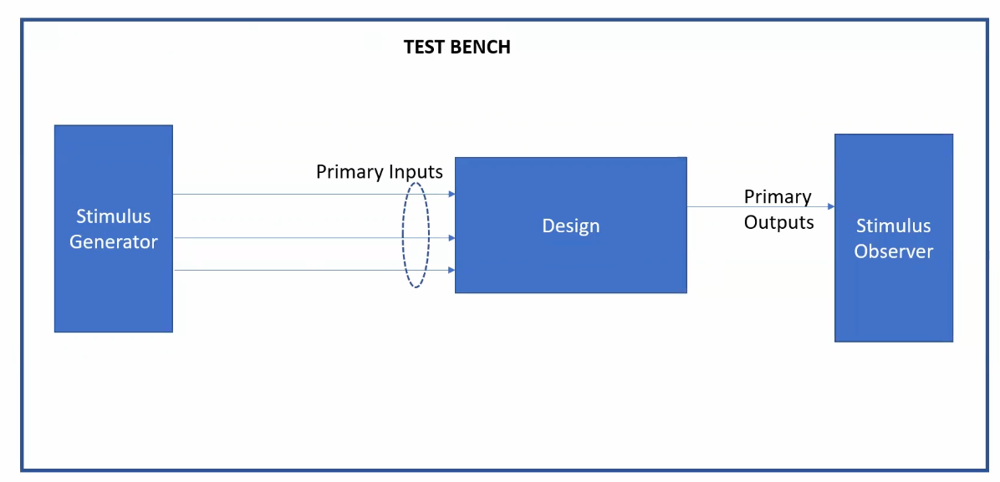
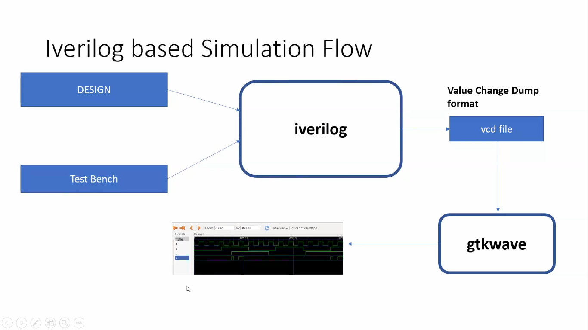
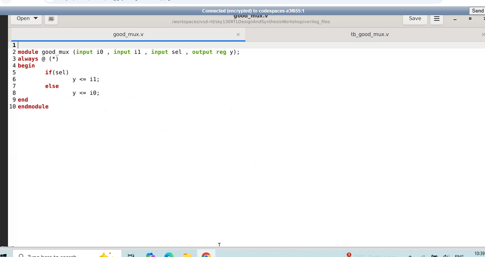
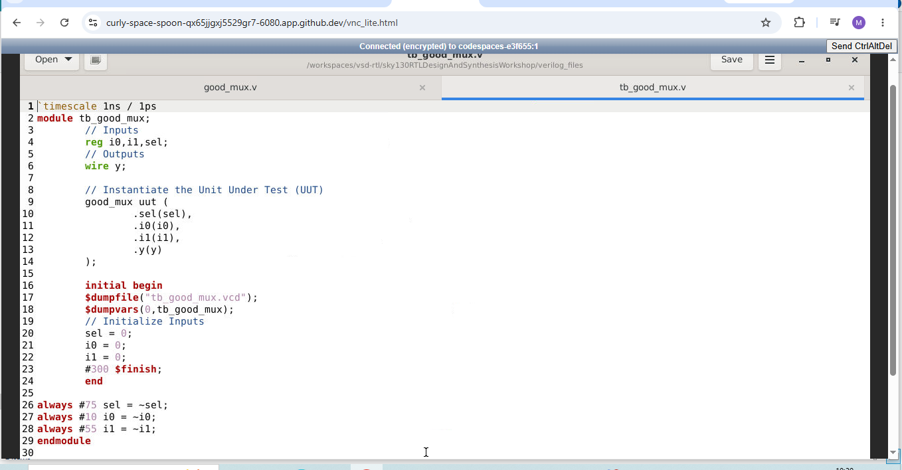
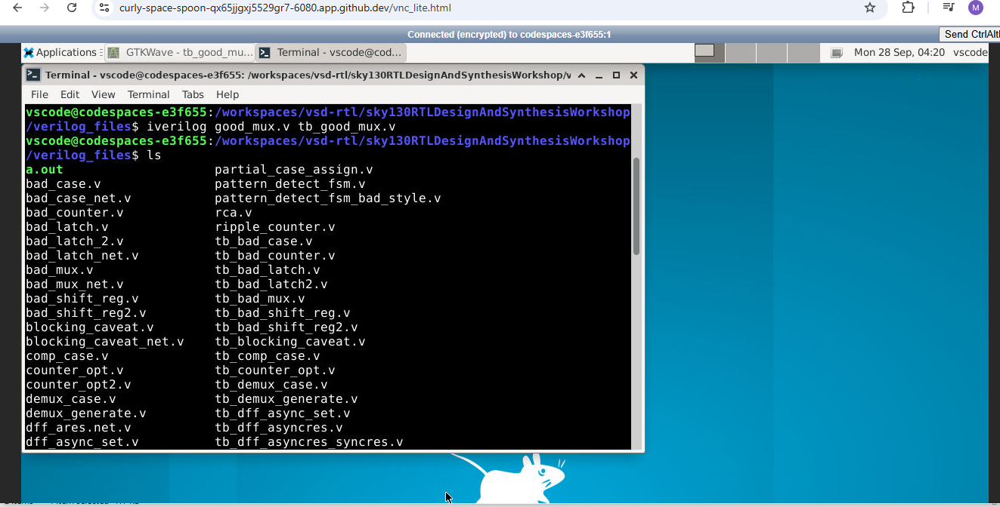
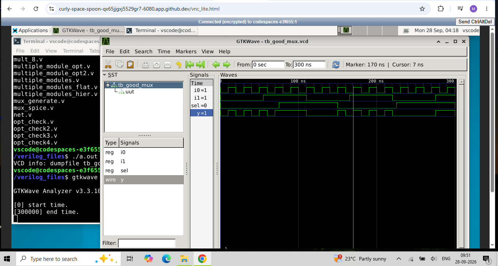
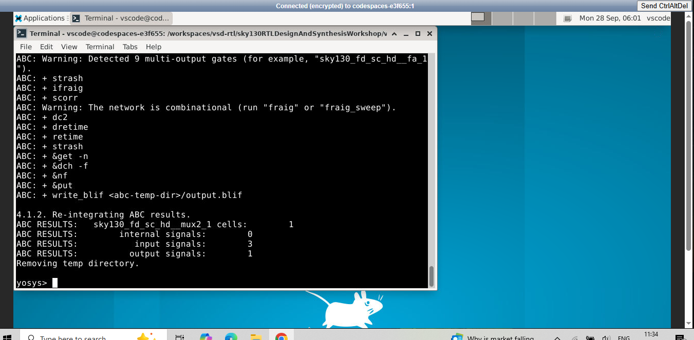
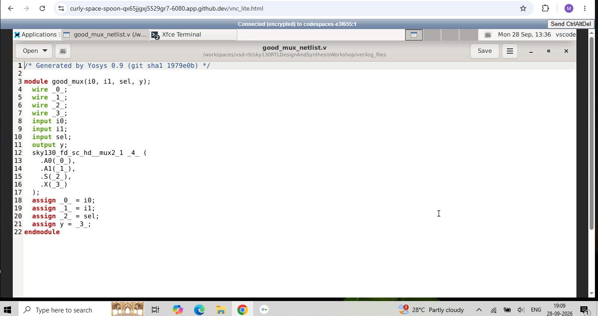
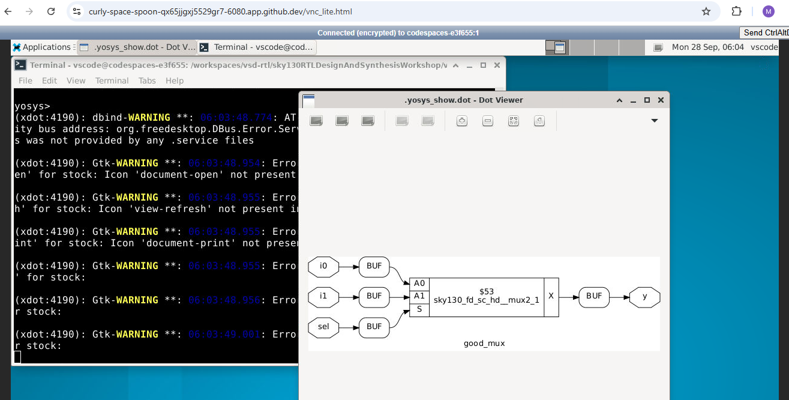

## RTL-to-Gate-Level Digital Design Flow

The main tools used are:

- **Verilog/SystemVerilog** for describing digital hardware
- **Icarus Verilog (iverilog)** for simulation
- **GTKWave** for viewing simulation waveforms
- **Yosys** for RTL synthesis

---

## RTL Design

**RTL** stands for **Register Transfer Level**.

The RTL design is the Verilog/SystemVerilog code that describes the intended hardware behavior.

For example:

```verilog
module good_mux (
    input  i0,
    input  i1,
    input  sel,
    output y
);

assign y = sel ? i1 : i0;

endmodule
```

This describes a 2:1 multiplexer.

The design contains:

- **Primary inputs:** `i0`, `i1`, `sel`
- **Primary output:** `y`

The RTL is the design we want to verify and eventually synthesize.

---

## Testbench

A testbench (TB) is the environment used to test the design.

The testbench:

1. Instantiates the design.
2. Generates input stimulus.
3. Observes the outputs.
4. Checks whether the output behaves as expected.


The testbench itself normally does not have the primary inputs and primary outputs of the design. Instead, it drives the design inputs and observes the design outputs.



---

## Simulation

Simulation is used to check whether the RTL follows the required specification.

The simulator used in this flow is:

```text
iverilog
```

The simulator evaluates the design as input values change. If there is no relevant input/event change, the simulator does not need to re-evaluate the corresponding logic.



**Commands:**

```bash
iverilog good_mux.v tb_good_mux.v
./a.out
```

Icarus Verilog takes both files, compiles them together, and by default creates an executable called a.out. ‘./’ means run the executable from the current directory.


## VCD Files

**VCD** stands for **Value Change Dump**.

A VCD file stores signal-value changes that occur during simulation. It is loaded into a waveform viewer such as GTKWave.

---

## GTKWave

GTKWave is a waveform viewer. It takes a VCD file and displays the signals graphically.

**Typical command:**

```bash
gtkwave filename.vcd
```

---

## Synthesis

The synthesis process converts RTL into a gate-level netlist.

```text
RTL
 |
 | synthesis
 v
Gate-level representation
 |
 v
NETLIST
```

The netlist contains actual cells and their connections.

For example, conceptually, the RTL:

```verilog
assign y = a & b;
```

may become something like:

```text
a ----\
       AND_CELL ---- y
b ----/
```

The actual cell name depends on the technology library.

---

## Yosys

Yosys is the synthesis tool used.

A basic Yosys flow is:

```text
RTL Verilog
     |
     | read_verilog
     v
   Yosys
     ^
     |
   .lib
     |
     v
Gate-level netlist
     |
     | write_verilog
     v
netlist.v
```

**Commands:**

```bash
yosys
read_liberty -lib /address/to/your/sky130/file/sky130_fd_sc_hd__tt_025C_1v80.lib
read_verilog good_mux.v
synth -top good_mux
abc -liberty /address/to/your/sky130/file/sky130_fd_sc_hd__tt_025C_1v80.lib
show
```

`read_liberty` tells Yosys to read a Liberty .lib file. `read_verilog` reads the RTL Verilog source into Yosys.`synth -top` is the main synthesis command; treats good_mux as top-level module.The command `abc -liberty` tells ABC to map the synthesized logic onto cells available in this .lib file

---

## .lib / Liberty File

A `.lib` file is a standard-cell library description. It describes the cells that are available for synthesis.

For example, a library can contain cells such as:

- `AND`
- `OR`
- `NOT`
- `BUF`
- `MUX`
- `DFF`

The library can also contain different versions, or flavours, of the same logical function. For example:

- `AND2_SLOW`
- `AND2_MED`
- `AND2_FAST`

These cells can implement the same logical function but have different timing, area, and power characteristics.

Digital logic has propagation delay. For example:

```text
DFF A ---> COMBINATIONAL LOGIC ---> DFF B
```

For the data to arrive correctly at DFF B, the clock period must satisfy a timing relationship such as:

```text
TCLK > TCO_A + TCOMB + TSETUP_B
```

where:

- `TCLK` = clock period
- `TCO_A` = clock-to-Q delay of DFF A
- `TCOMB` = combinational logic delay
- `TSETUP_B` = setup time of DFF B

Reducing combinational delay can therefore help the circuit operate at a higher frequency.

---

## Fast Cells vs Slow Cells

A faster cell generally has lower delay. One way to make a cell faster is to use larger/wider transistors. That can increase:

- Area
- Power

A slower cell can have higher delay, lower area, and potentially lower power consumption.

Therefore, using the fastest cell everywhere is not necessarily desirable. The synthesizer tries to choose cells that satisfy the required constraints while balancing implementation cost.

---

## Why Use Slow Cells?

This is related to hold timing.

A simplified hold constraint is:

```text
THOLD_B < TCO_A + TCOMB
```

If data travels too quickly from DFF A to DFF B, DFF B can experience a hold violation.

Therefore, slower cells can sometimes be useful for adding delay to a path. The `.lib` therefore provides multiple cell options with different timing characteristics.

---

## Gate-Level Netlist

After synthesis, Yosys produces a netlist. The netlist represents the circuit using cells from the target library.

The same testbench can often be used because the synthesized netlist retains the same primary input/output interface.

---

## Labs

**Design and Testbench**




**Simulation Output**



**Waveform**



**Synthesis**






