## Meaning of `sky130_fd_sc_hd__tt_025C_1v80.lib`

`tt` means **Typical-Typical**.

A semiconductor process doesn't behave exactly the same every time. Manufacturing variations cause transistors to be somewhat faster or slower. So libraries are characterized at different process corners.

Common examples include:

| Corner | Meaning |
|---|---|
| `tt` | Typical / Typical |
| `ff` | Fast / Fast |
| `ss` | Slow / Slow |

`025C_1v80` tells us the operating conditions under which the cells were characterized:

- `025C` → 25°C
- `1v80` → 1.80 V

Different flavours of the same gate are available so that the trade-off between different parameters like area, power consumption, delay, etc. can be fulfilled.

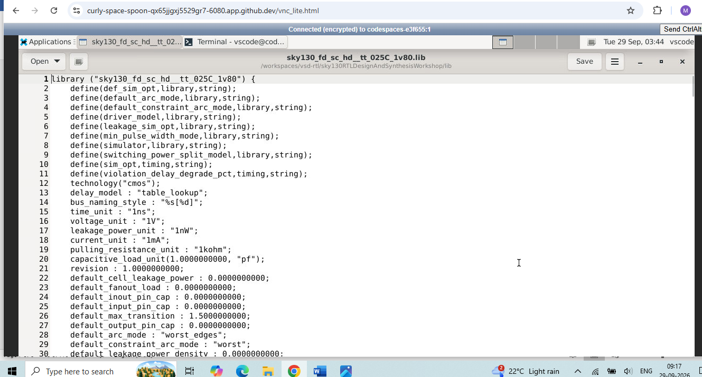

---

## DFF Synthesis with SKY130 Cells

After synthesis and technology mapping, the abstract RTL flip-flop is replaced by an actual SKY130 standard cell.

For example:

```text
sky130_fd_sc_hd__dfrtp_1
sky130_fd_sc_hd__dfstp_2
sky130_fd_sc_hd__dfxtp_1
```

The exact cell chosen depends on the required functionality and the synthesis/mapping result.

**Command:**

```bash
dfflibmap -liberty /address/to/your/sky130/file/sky130_fd_sc_hd__tt_025C_1v80.lib
```

---

## DFF with Asynchronous Reset

In an asynchronous-reset DFF, asserting the reset can change `q` without waiting for a clock edge.

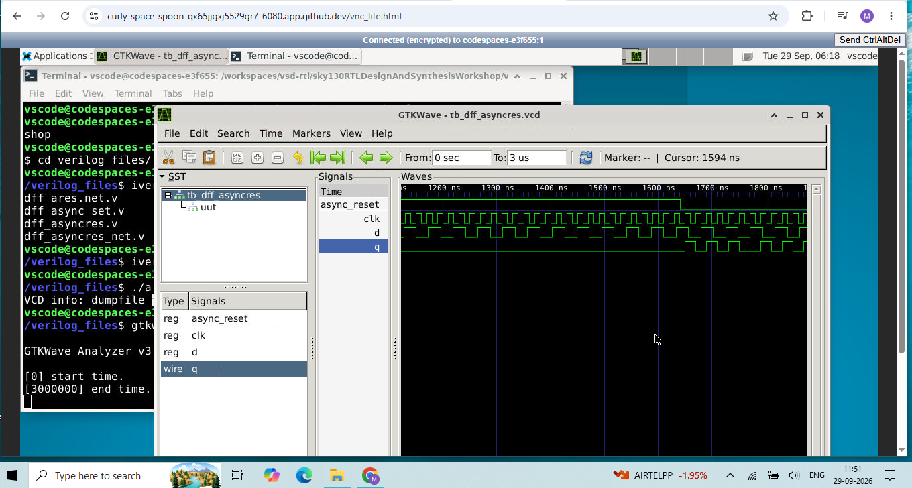
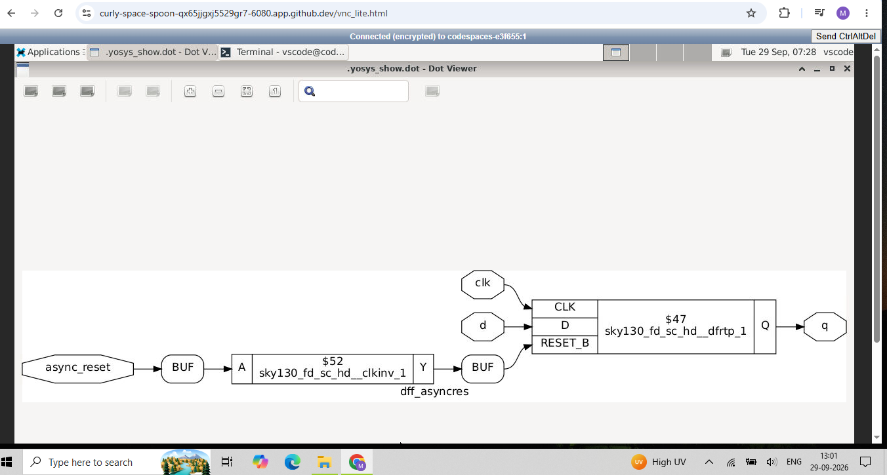

---

## DFF with Asynchronous Set

An asynchronous set similarly forces the output to its set state independently of the clock.

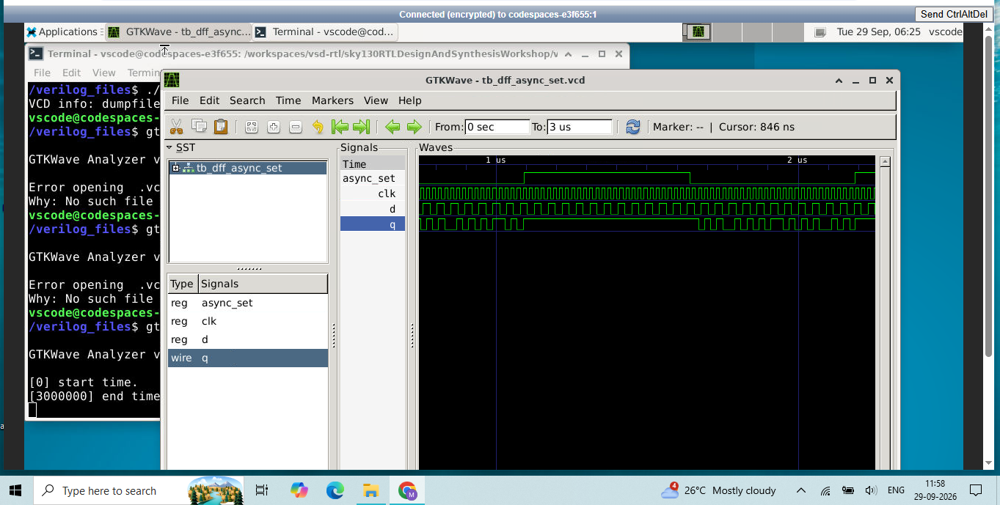
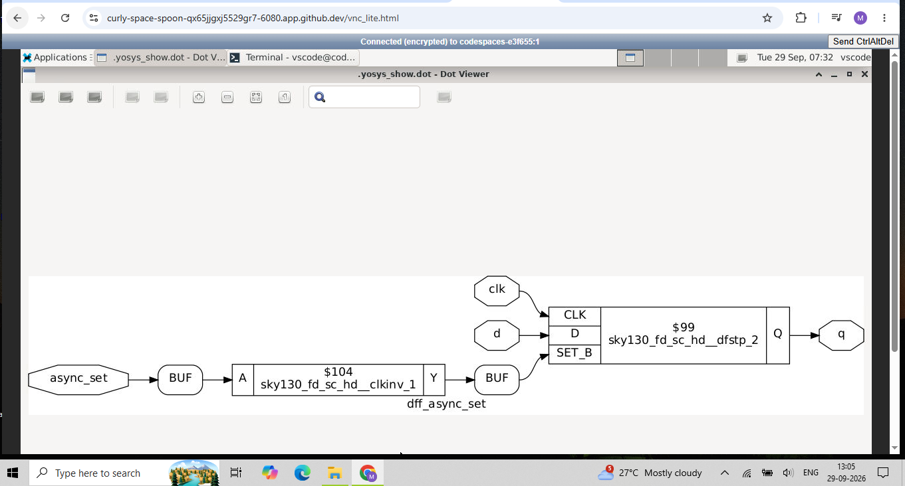

---

## Synchronous Reset

The set operation comes into effect only in the presence of a rising or falling edge of the clock.

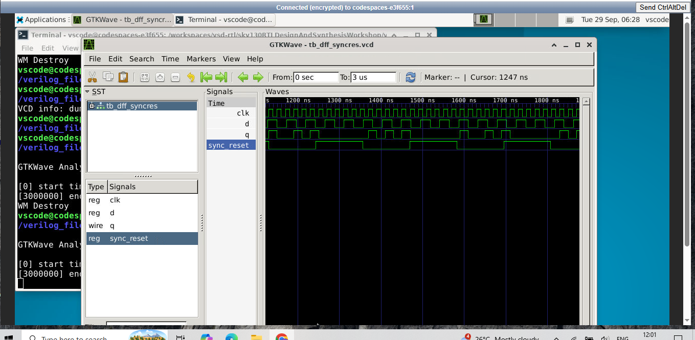
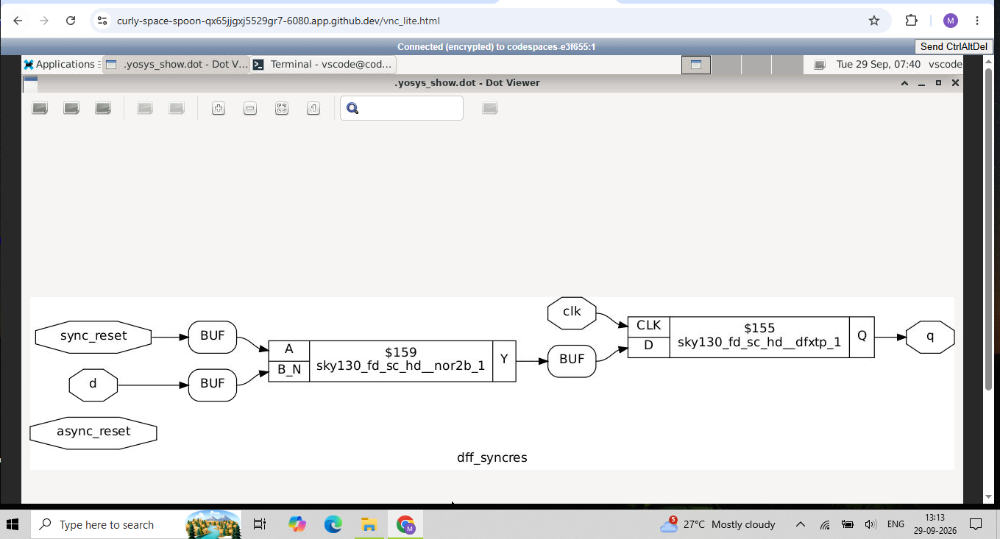

---

## Hierarchical RTL

The `multiple_modules` example demonstrates hierarchical design.

The logic is:

```text
a ----\
       AND ---- net1 ----\
b ----/                   OR ---- y
                         /
c ----------------------/
```

Therefore:

```text
net1 = a & b
y    = net1 | c
```

That is:

```text
y = (a & b) | c
```

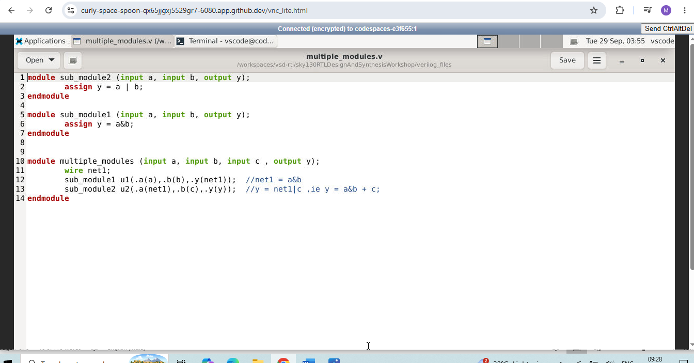
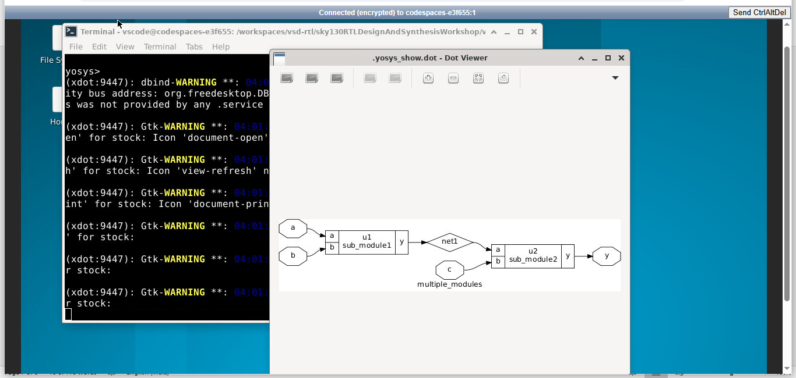
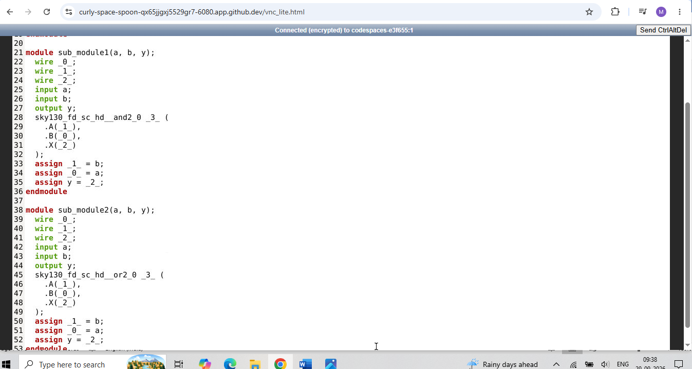

The blocks `u1` and `u2` represent instances of the submodules. This is called a **hierarchical representation** because the internal modules are still visible.

After synthesis, the design can still be viewed hierarchically. Here the submodule boundaries are visible, but the logic inside the submodules has been mapped to SKY130 cells.

For example:

```text
sub_module1
     |
     v
sky130_fd_sc_hd__and2_0
```

and:

```text
sub_module2
     |
     v
sky130_fd_sc_hd__or2_0
```

So the hierarchy remains:

```text
multiple_modules
   |
   +-- u1 : sub_module1
   |
   +-- u2 : sub_module2
```

while the internal implementation is now standard-cell based.

---

## Flattened Synthesis

Flattening removes the module hierarchy and places the logic into one top-level netlist.

**Before flattening:**

```text
multiple_modules
    |
    +--- u1 : sub_module1
    |
    +--- u2 : sub_module2
```

**After flattening:**

```text
multiple_modules
    |
    +--- AND cell
    |
    +--- OR cell
    |
    +--- wires
```

---

## Flattened Schematic

The flattened view exposes the actual logic implementation more directly. The design becomes essentially:

```text
a ----\
       AND ----\
b ----/         \
                OR ---- y
c --------------/
```

with the gates represented by actual SKY130 cells.

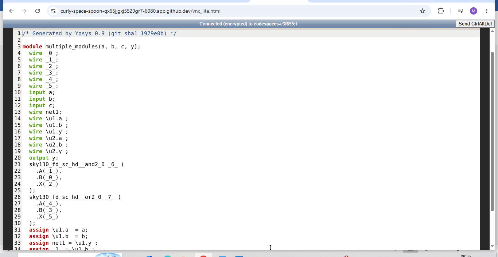
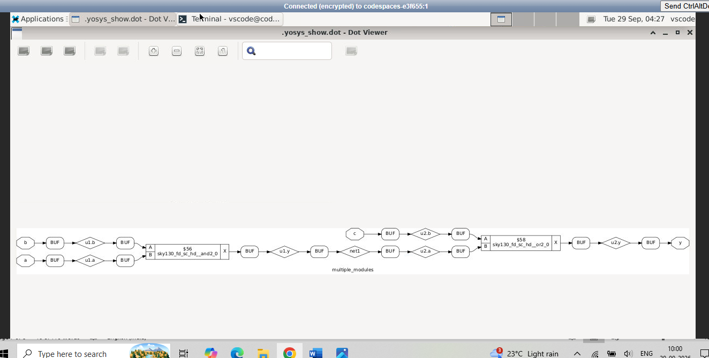

---

## Submodule Technology Mapping

The screenshot below shows the synthesized implementation of `sub_module1`.

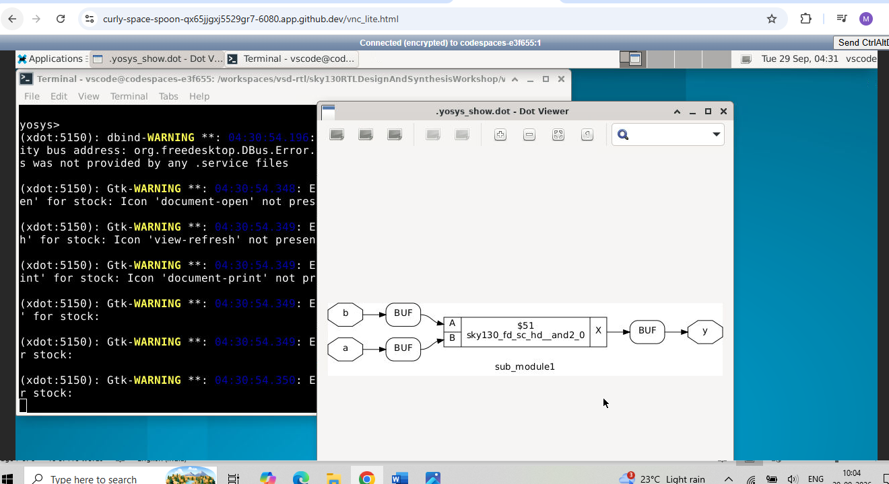

The original RTL:

```verilog
assign y = a & b;
```

is mapped to a SKY130 AND cell:

```text
a ----\
       AND2 ---- y
b ----/
```

The corresponding mapped cell is shown as:

```text
sky130_fd_sc_hd__and2_0
```

---

## Multiplication by 2

The generated module is:

```verilog
module mul2(a, y);
    input [2:0] a;
    output [3:0] y;

    assign y = {a, 1'h0};
endmodule
```

The operation:

```text
y = {a, 1'b0}
```

is equivalent to appending a zero to the LSB. This is equivalent to:

```text
y = a * 2
```

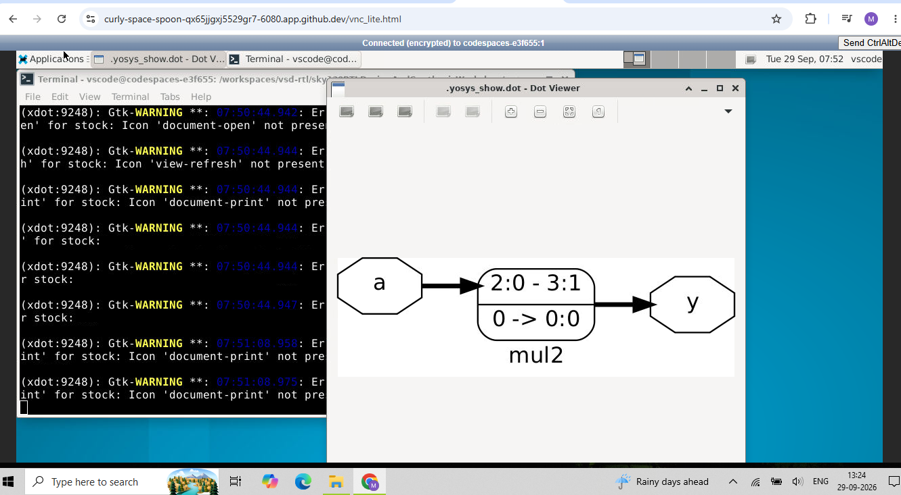
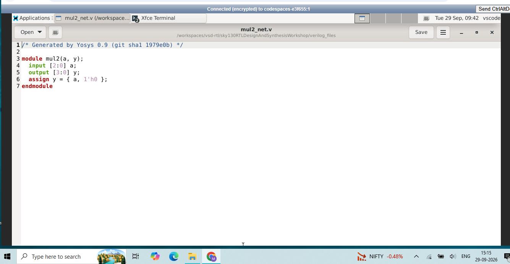

---

## Multiplication by 8

The example uses:

```verilog
input  [2:0] a;
output [5:0] y;

assign y = {a, a};
```

This duplicates the vector. The generated schematic indicates the corresponding bit-level operation.

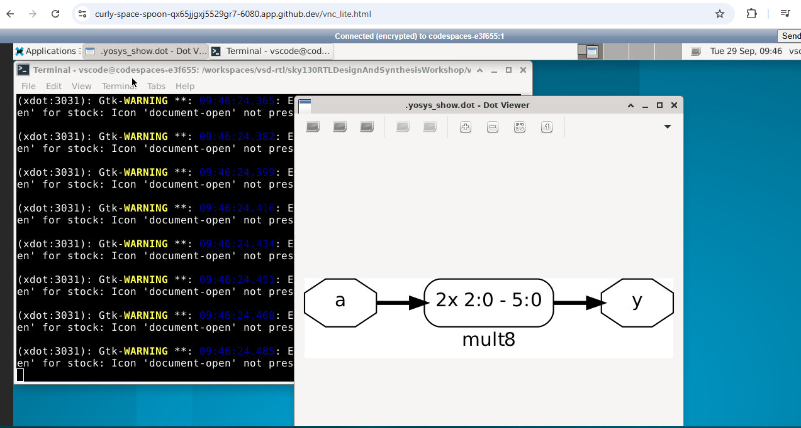
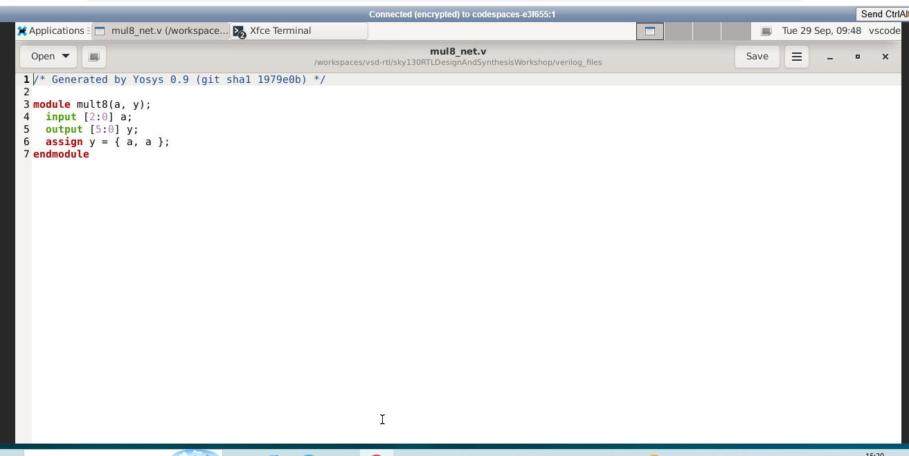

Not every expression containing a multiplication requires a physical multiplier circuit. Synthesis recognizes the actual Boolean/bit-level operation and optimizes it accordingly. The `abc -liberty` command also notes that it will not call `abc`, as no cells have been instantiated.
